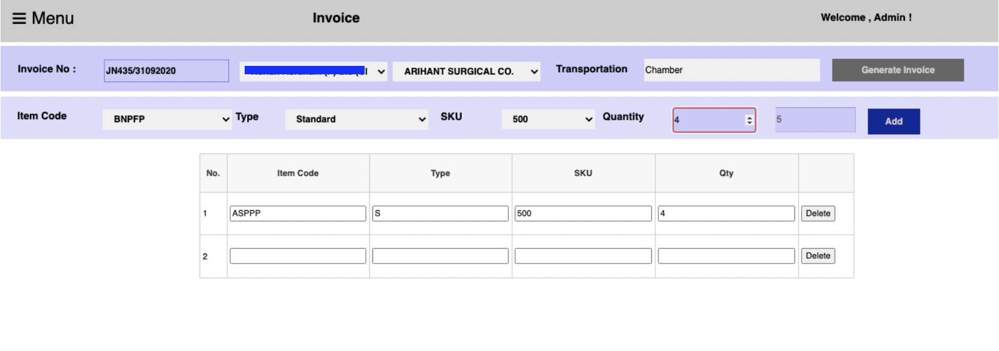
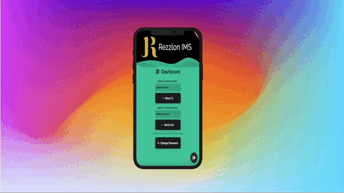

# Flutter based Inventory Management System with MSSQL Backend and ASP.NET
IEWMS is our unique customisable solution which provides your warehouse and workers with
realtime access to Warehouse Management to improve accuracy and boost worker productivity.
This can be deployed in warehouses and manufacturing plants to provide end to end inventory
control from receipt of finished goods through production to dispatch. Rezzlon’s IEWMS drives
greater speed, accuracy, productivity, agility and efficiency throughout your supply chain.

# Features
- Automate all your Inbound & Outbound inventory movements with less paperwork
- Realtime mobile based goods movement tracking within the inventory which reduces the use of third party scanners.
- Any android enabled device can be transformed into IEWMS Compatible scanner which enables flexibility and customisability.
- Implement dynamic and App-based directed outward movement using pick strategies including FIFO, LIFO and Shelf life Expiry date etc. Any violations to perform the above will be recorded with the worker’s name along with the time of violation.
- Customisable and user-friendly reports for in-depth analysis of the ware house movement.
- Conventional Barcode has been replaced with QR enabled codes for flexibility and customizability of codes.
- Systematic movement of the goods is handled properly to minimize on losses and also save time.
- Compatibility to serialize each and every product to implement ‘Anti Counterfeiting’ and ‘Track and Trace” Solutions.
- Generate XML reports compatible with TALLY Erp
- Picklist is made breezy and automated, it forces workers to pick the right goods from the stock to be sent out of the warehouse.
# Database Structure 

## Modules 

-  Stock In (Label Printing) :

- Stock Out (Outward Invoice generation):

- Stock Out Invoice:

- ### Reports:
- Stock In Report ( Date-wise search, Item-wise search, Godown wise ):
- Stock Out Report (Date-wise search, Item-wise search, Godown wise ):
- Closing Stock Report ( Inward / Outward efficiency calculation and report of current stock in the godown ):
- FIFO Violation Report ( Any violation of FIFO in the godown is marked by IEWMS and be viewed:
- QR Code Report (Date-wise, Item-wise, Inward Number wise and type-wise):

- Items Management 

  
## Flutter Mobile Scanner App made to connect with the online portal: 

  

## Appendix
- FIFO and LIFO Compatible Inventory Management System : 
Rezzlon provides client customizable solutions to ensure faster beltway for improved order processing

- Multi-Location Management : 
You can manage inventory and stocks at the company level or warehouse level.

- Easy and Understandable Reports : 
User friendly reports of all processes and stocks in the inventory

- All services in one : 
Manage Inward Processes, Outward Processes, Stock Movement, FIFO violations and many more.

  
